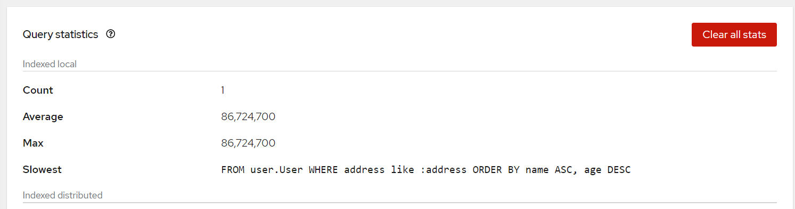

# Querying Cache with Infinispan 13

## Running Infinispan
Pull from `Quay`
```
$ docker pull quay.io/infinispan/server:13.0.10.Final
```

Run the instance
```
$ docker run -p 11222:11222 -e USER=admin -e PASS=password \
        --add-host=HOST:192.168.56.1 \ 
        quay.io/infinispan/server:13.0.10.Final
```

## Create the Cache
```xml
<?xml version="1.0"?>
<replicated-cache name="user-cache" mode="SYNC" remote-timeout="300000" statistics="true">
    <encoding>
        <key media-type="application/x-protostream"/>
        <value media-type="application/x-protostream"/>
    </encoding>
    <locking concurrency-level="1000" isolation="READ_COMMITTED" acquire-timeout="60000" striping="false"/>
    <transaction mode="NON_XA" auto-commit="true" stop-timeout="30000" locking="PESSIMISTIC" reaper-interval="30000" complete-timeout="60000" notifications="true" transaction-manager-lookup="org.infinispan.transaction.lookup.GenericTransactionManagerLookup"/>
    <memory storage="OFF_HEAP"/>
    <state-transfer timeout="300000"/>
    <indexing enabled="true"
              storage="filesystem" path="user-cache">
        <indexed-entities>
            <indexed-entity>user.User</indexed-entity>
        </indexed-entities>
    </indexing>
</replicated-cache>
```

## Setting-Up Index
Setting-up `@ProtoDoc` annotation would make our cache is `indexed`.
```java
@ProtoDoc("@Indexed")
public class User implements Serializable {

    @ProtoField(number = 1, required = true)
    @ProtoDoc("@Field(index=Index.YES, analyze = Analyze.NO, store = Store.YES)")
    protected String name;
}
```

## Do Queries
```java
    public List<User> getUsersFromCity(String address) {
        RemoteCache remoteCache = remoteCacheManager.getCache("user-cache");
        QueryFactory queryFactory = Search.getQueryFactory(remoteCache);

        Query<User> query = queryFactory.create("FROM user.User WHERE address like :address ORDER BY name ASC, age DESC");
        query.setParameter("address", address);

        return query.execute().list();
    }
}
```

## Indexed Cache
an indexed cache would give below result on the `Query Statistic` page,
